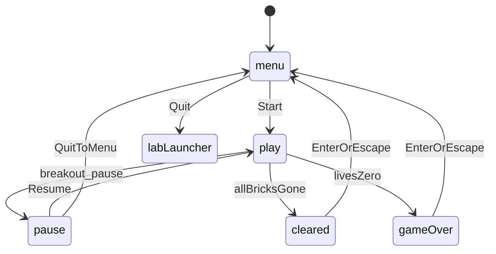

# Breakout scene flow

```mermaid
stateDiagram-v2
  [*] --> menu
  menu --> play: Start
  play --> pause: breakout_pause
  pause --> play: Resume
  pause --> menu: QuitToMenu
  play --> cleared: allBricksGone
  play --> gameOver: livesZero
  cleared --> menu: EnterOrEscape
  gameOver --> menu: EnterOrEscape
  menu --> labLauncher: Quit
```
