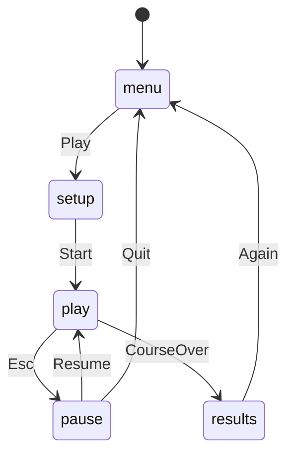
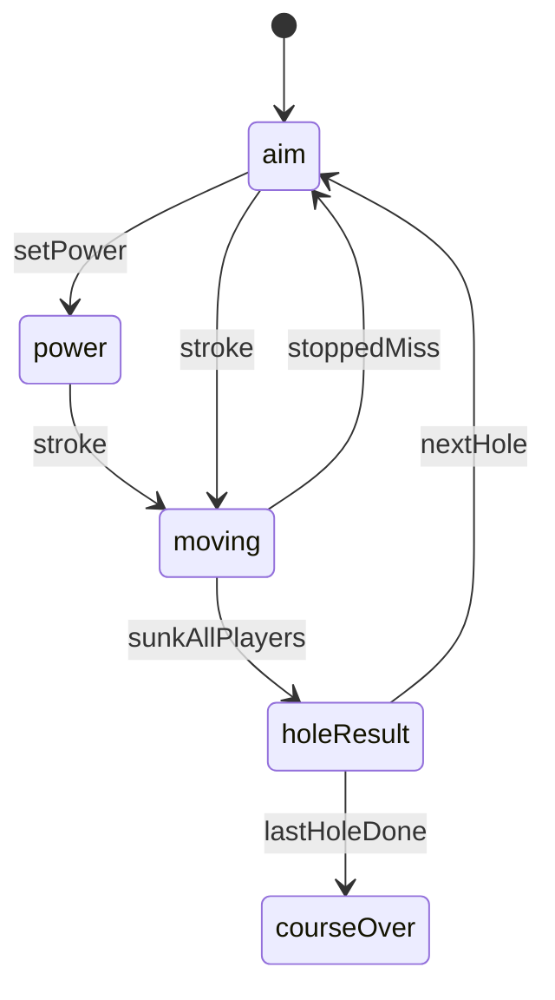

# Fairway Circuit flow

```mermaid
stateDiagram-v2
  [*] --> menu
  menu --> setup: Play
  setup --> play: Start
  play --> pause: Esc
  pause --> play: Resume
  pause --> menu: Quit
  play --> results: CourseOver
  results --> menu: Again
```

```mermaid
stateDiagram-v2
  [*] --> aim
  aim --> power: setPower
  power --> moving: stroke
  aim --> moving: stroke
  moving --> aim: stoppedMiss
  moving --> holeResult: sunkAllPlayers
  holeResult --> aim: nextHole
  holeResult --> courseOver: lastHoleDone
```

Per-hole hotseat: when one seat sinks, the next unfinished seat tees off on the same hole. `hole_complete` fires only after every seat finishes; then `advance_after_hole`.
